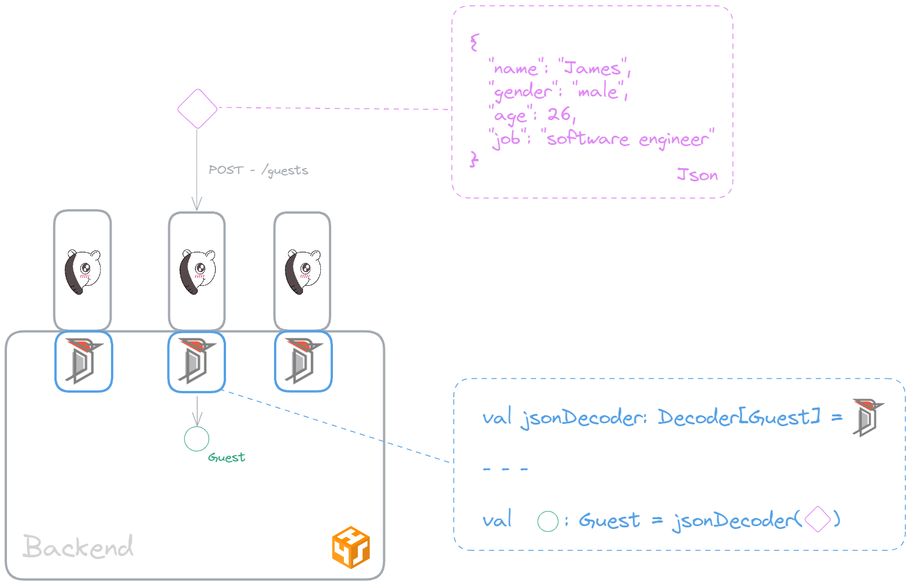
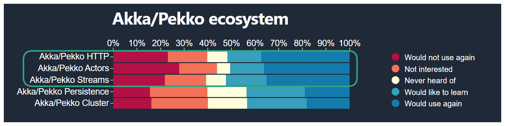
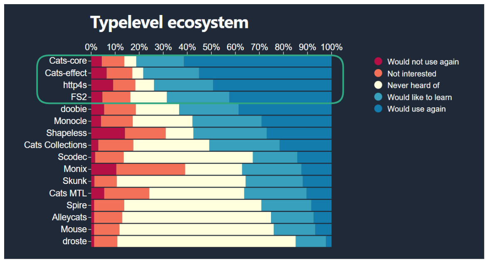

What if I told you there exists in Scala a way to build Rest APIs and generate SwaggerUI docs simultaneously? Moreover, it's as fast as using FastAPI (for those familiar with Python), while retaining the strong type safety and functional programming style of Scala! 😲 In this post, we'll explore this exciting tech stack: Tapir, http4s, and Circe!

<!-- more -->

## 😎 Why Tapir, http4s, Circe?

Let's check out what is each library:

- Tapir: A powerful Scala library for defining and documenting HTTP APIs in a type-safe and functional manner, with built-in support for generating Swagger UI documentation.
- http4s: A lightweight, purely functional Scala library for building HTTP servers and clients, designed for high performance and composability.
- Circe: A popular JSON library for Scala that provides seamless JSON parsing and encoding using a powerful and idiomatic functional approach.

<figure markdown="span">
  
  <figcaption>Handling Requests</figcaption>
</figure>

As of now, in the Scala ecosystem, there are no actively maintained, production-ready alternatives to Tapir. However, alternatives to http4s include Play and Akka/Pekko Http, with Play being more a full-stack web framework. For JSON handling, alternatives to Circe include json4s, ZIO-json, and Play JSON. According to the [2023 Scala survey](https://scalasurvey2023.virtuslab.com/), it appears that the community is leaning towards the Typelevel ecosystem when it comes to building backend systems. You can also check library comparison websites like [LibHunt](https://scala.libhunt.com/) for further insights.

<figure markdown="span">
  
  
  <figcaption>Akka/Pekko ecosystem VS Typelevel ecosystem</figcaption>
</figure>

Either way, all these alternatives are production-ready and actively maintained. You cannot go wrong with choosing any of them.

## 🚀 Adventure Begins!

### 🏰 Backend Lair Setup

### ⚔️ First Epic Endpoint!

## 🎨 Mastering Circe & Tapir

### ✨ Auto Derivation Magic!

### 🧙‍♂️ Crack ADTs!

## 🌟 Happy Endings!
