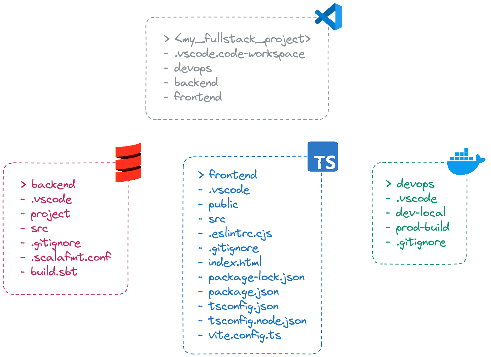
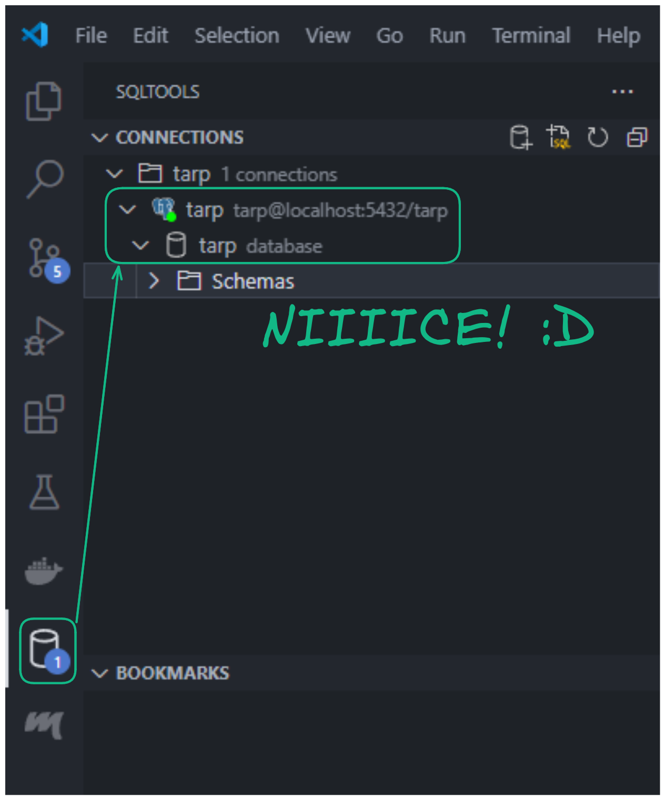
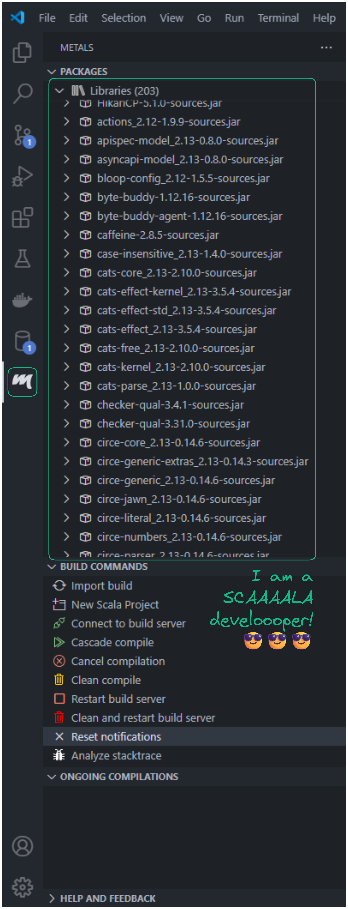

I landed my first job as a Data Engineer using [Scala](https://www.scala-lang.org/). It's been over 3 years now, approaching 4 years. The more experience you gain, the more you want to spread your wings 🪽 to tackle even bigger and more complex projects than just data pipelines, like developing **full-stack web data applications**. But, I really do not want to dissipate myself too much on all the programming languages, libraries, or frameworks out there 😣. These are just tools. What's important is how efficiently you can use them for the product or feature you envisioned 🦄🌈. Sooo! For me, it's currently the **TARP** tech stack!

<!-- more -->


## 🤔 What is TARP?

**TARP** stands for **Tapir**, **React** and **PostgreSQL**. In detail:

- 🦛 [**Tapir**](https://tapir.softwaremill.com/en/latest/): For the backend, it's a lightweight library similar to [FastAPI](https://fastapi.tiangolo.com/), designed for building endpoints and providing free SwaggerUI docs.
- ⚛️ [**React**](https://react.dev/): For the frontend, it's the most popular framework with the largest community, according to the [Stack Overflow Developer Survey 2023](https://survey.stackoverflow.co/2023/#section-admired-and-desired-web-frameworks-and-technologies).
- 🐘 [**PostgreSQL**](https://www.postgresql.org/): Chosen for the database due to its popularity and strong community support, as indicated by the [Stack Overflow Developer Survey 2023](https://survey.stackoverflow.co/2023/#section-admired-and-desired-web-frameworks-and-technologies).

I'm really excited 😄 to demonstrate how productive you can be with this tech stack. Let's start building, shall we! By the way, do you know what "TARP" stands for? 🤣 A tarp functions as a waterproof protective cover, for example, when building tents ⛺.

## 👨‍💻 Development Environment

For your coding environment, I highly recommend using [VSCode](https://code.visualstudio.com/). It has amazing support for [TypeScript](https://www.typescriptlang.org/) and [Docker](https://www.docker.com/) with various extensions. Scala development can also be done on VSCode using the [Metals](https://scalameta.org/metals/docs/editors/vscode/) extension. I used to develop on IntelliJ, but got tired of switching between VSCode and [IntelliJ](https://www.jetbrains.com/idea/) 😫. So yeah, if you have to handle more than just Scala code, just go with VSCode 😋.

Let's create 3 folders: `./devops`, `./backend`, `./frontend`, and also the `./vscode.code-workspace` file.

```json title="./vscode.code-workspace"
{
  "folders": [
    {
      "path": "backend"
    },
    {
      "path": "devops"
    },
    {
      "path": "frontend"
    }
  ]
}
```

You've just organized your project into [VSCode workspaces](https://code.visualstudio.com/docs/editor/workspaces). This is a way to instruct VSCode to treat each folder as an independent workspace, allowing you to **work on them simultaneously within a single VSCode window**. When you open the `./vscode.code-workspace` file using VSCode, it will automatically detect three workspaces.

<figure markdown="span">
  
  <figcaption>VSCode workspaces</figcaption>
</figure>

The goal of this section is to establish a well-structured VSCode folder for your FullStack application as shown below 👇.

<figure markdown="span">
  
  <figcaption>Folder structure</figcaption>
</figure>

Let's start! 😤

### Database

The goal here is to set up a local PostgreSQL database and be able to explore it with suitable tools. This will be achieved using a [PostgreSQL Docker container](https://hub.docker.com/_/postgres) and the SQLTools VSCode extension. Please install:

- 🐳 [Docker Desktop](https://www.docker.com/products/docker-desktop/): For setting up a local PostgreSQL database.
- ➕ [Docker](https://code.visualstudio.com/docs/containers/overview) VSCode extension: To execute Docker commands directly via the VSCode UI.
- 🔎 [SQLTools](https://marketplace.visualstudio.com/items?itemName=mtxr.sqltools) and [SQLTools PostgreSQL/Cockroach Driver](https://marketplace.visualstudio.com/items?itemName=mtxr.sqltools-driver-pg) VSCode extensions: For viewing the local PostgreSQL database.

Let's create a [Docker Compose](https://docs.docker.com/compose/gettingstarted/) file, which is simply a YAML file with specific syntax, to run the local PostgreSQL database.

```yaml title="./devops/dev-local/docker-compose.yml"
services:
  database:
    image: postgres:16.2
    ports:
      - "5432:5432"
    environment:
      - POSTGRES_PASSWORD=tarp
      - POSTGRES_USER=tarp
      - POSTGRES_DB=tarp
    volumes:
      - ./data:/var/lib/postgresql/data # Optional, but can keep our database data persistent on the host disk.
```

You are now all set to run it:

- Right click on `devops/dev-local/docker-compose.yml`
- Click on `Compose Up`

After a little while, if you go to the Docker Desktop application, you should see your local PostgreSQL database running 😃!

<figure markdown="span">
  
  <figcaption>PostgreSQL container</figcaption>
</figure>

To ensure the local PostgreSQL setup is correct, you can explore it using the SQLTools extension in VSCode. To do this, add a new connection in SQLTools:

- `CTRL + SHIFT + P`
- Click on `SQLTools Management: Add New Connection`
- Follow the instructions and fill in the fields according to how the PostgreSQL container is defined in `devops/dev-local/docker-compose.yml`

<figure markdown="span">
  
  <figcaption>PostgreSQL view using SQLTools</figcaption>
</figure>

If you've reached this point, your local PostgreSQL database is now all set for development! 👍

### Backend

Let's set up our Scala project! First, install:

- ☕️ [Java 17](https://adoptium.net/temurin/releases/?version=17): Because Scala runs on top of the JVM.
- ⚙️ [Metals](https://scalameta.org/metals/docs/editors/vscode/) VSCode extension: For supporting us during implementation in Scala.

Then, two files must be defined:

- `./backend/project/build.properties`: For specifying the [SBT](https://www.scala-sbt.org/) (the Scala dependencies manager) version.

```properties title="./backend/project/build.properties"
# https://github.com/sbt/sbt (look tags for version)
sbt.version=1.9.9
```

- `./backend/build.sbt`: For project metadata and dependencies.

```scala title="./backend/build.sbt"
/**
 * Project configurations.
 */
ThisBuild / scalaVersion := "2.13.13" // https://www.scala-lang.org/download/all.html
lazy val root = (project in file(".")).settings(name := "backend")

/**
 * Dev dependencies.
 */
// Cats & Scala extensions
// https://mvnrepository.com/artifact/org.typelevel/cats-effect
libraryDependencies += "org.typelevel" %% "cats-effect"        % "3.5.4"
// https://github.com/oleg-py/better-monadic-for (look tags for version)
addCompilerPlugin("com.olegpy"         %% "better-monadic-for" % "0.3.1")
// https://mvnrepository.com/artifact/dev.optics/monocle-core
libraryDependencies += "dev.optics"    %% "monocle-core"       % "3.2.0"
// https://mvnrepository.com/artifact/dev.optics/monocle-macro
libraryDependencies += "dev.optics"    %% "monocle-macro"      % "3.2.0"

// Tapir
// https://mvnrepository.com/artifact/com.softwaremill.sttp.tapir/tapir-http4s-server
libraryDependencies += "com.softwaremill.sttp.tapir" %% "tapir-http4s-server"     % "1.10.4"
// https://mvnrepository.com/artifact/com.softwaremill.sttp.tapir/tapir-json-circe
libraryDependencies += "com.softwaremill.sttp.tapir" %% "tapir-json-circe"        % "1.10.4"
// https://mvnrepository.com/artifact/com.softwaremill.sttp.tapir/tapir-swagger-ui-bundle
libraryDependencies += "com.softwaremill.sttp.tapir" %% "tapir-swagger-ui-bundle" % "1.10.4"

// Http4s
// https://mvnrepository.com/artifact/org.http4s/http4s-ember-server
libraryDependencies += "org.http4s" %% "http4s-ember-server" % "0.23.26"
// https://mvnrepository.com/artifact/org.http4s/http4s-circe
libraryDependencies += "org.http4s" %% "http4s-circe"        % "0.23.26"
// https://mvnrepository.com/artifact/org.http4s/http4s-dsl
libraryDependencies += "org.http4s" %% "http4s-dsl"          % "0.23.26"
// https://mvnrepository.com/artifact/org.http4s/http4s-ember-client
libraryDependencies += "org.http4s" %% "http4s-ember-client" % "0.23.26"

// Log4j2
// https://mvnrepository.com/artifact/org.typelevel/log4cats-core
libraryDependencies += "org.typelevel" %% "log4cats-core" % "2.6.0"
// https://mvnrepository.com/artifact/org.slf4j/slf4j-simple
libraryDependencies += "org.slf4j"      % "slf4j-simple"  % "2.0.13"

// Circe
// https://mvnrepository.com/artifact/io.circe/circe-parser
libraryDependencies += "io.circe" %% "circe-parser"         % "0.14.6"
// https://mvnrepository.com/artifact/io.circe/circe-generic
libraryDependencies += "io.circe" %% "circe-generic"        % "0.14.6"
// https://mvnrepository.com/artifact/io.circe/circe-generic-extras
libraryDependencies += "io.circe" %% "circe-generic-extras" % "0.14.3"
// https://mvnrepository.com/artifact/io.circe/circe-literal
libraryDependencies += "io.circe" %% "circe-literal"        % "0.14.6"

// Doobie
// https://mvnrepository.com/artifact/org.tpolecat/doobie-core
libraryDependencies += "org.tpolecat" %% "doobie-core"     % "1.0.0-RC5"
// https://mvnrepository.com/artifact/org.tpolecat/doobie-postgres
libraryDependencies += "org.tpolecat" %% "doobie-postgres" % "1.0.0-RC5"
// https://mvnrepository.com/artifact/org.tpolecat/doobie-hikari
libraryDependencies += "org.tpolecat" %% "doobie-hikari"   % "1.0.0-RC5"

// Flyway
// https://mvnrepository.com/artifact/org.flywaydb/flyway-core
libraryDependencies += "org.flywaydb" % "flyway-core"                % "10.11.1"
// https://mvnrepository.com/artifact/org.flywaydb/flyway-database-postgresql
libraryDependencies += "org.flywaydb" % "flyway-database-postgresql" % "10.11.1" % "runtime"

/**
 * Test dependencies.
 */
// https://mvnrepository.com/artifact/org.scalatest/scalatest
libraryDependencies += "org.scalatest" %% "scalatest"          % "3.2.18"  % Test
// https://mvnrepository.com/artifact/org.mockito/mockito-scala
libraryDependencies += "org.mockito"   %% "mockito-scala"      % "1.17.31" % Test
// https://mvnrepository.com/artifact/org.mockito/mockito-scala-cats
libraryDependencies += "org.mockito"   %% "mockito-scala-cats" % "1.17.31" % Test
```

To instruct Metals to set up the Scala environment and install the dependencies:

- `CTRL + SHIFT + P`
- `Metals: Import build`

Then, go to the Metals extension view to confirm it's correctly set up 😎:

<figure markdown="span">
  
  <figcaption>Metals extension</figcaption>
</figure>

!!! warning

    [Metals uses VSCode workspace setup](https://scalameta.org/metals/blog/2023/07/17/workspace-folders) to detect Scala projects. So, it's important to have correctly set up VSCode workspaces as explained previously!

We're also going to initialize the backend API and database driver.

- First, set up the environement variables 🔑.

```scala title="./backend/src/main/scala/confs/EnvConf.scala"
package confs

case class EnvConf() {
  private val allEnvVar: Map[String, String] = sys.env

  val devMode: Boolean =
    allEnvVar.getOrElse("TARP_DEV_MODE",
                        default = "true") == "true" // To handle different behaviors in dev and prod environments
  val port: Int = allEnvVar.getOrElse("TARP_PORT", default = "8080").toInt

  val postgresIp: String       = allEnvVar.getOrElse("TARP_POSTGRES_IP", default = "localhost")
  val postgresPort: Int        = allEnvVar.getOrElse("TARP_POSTGRES_PORT", default = "5432").toInt
  val postgresDb: String       = allEnvVar.getOrElse("TARP_POSTGRES_DB", default = "tarp")
  val postgresUser: String     = allEnvVar.getOrElse("TARP_POSTGRES_USER", default = "tarp")
  val postgresPassword: String = allEnvVar.getOrElse("TARP_POSTGRES_PASSWORD", default = "tarp")
  val postgresSchema: String   = allEnvVar.getOrElse("TARP_POSTGRES_SCHEMA", default = "tarp")
}

object EnvConf { implicit val impl: EnvConf = EnvConf() }
```

- Second, integrate 🦛 Tapir using [http4s](https://http4s.org/v0.23/docs/quickstart.html) under the hood.

```scala title="./backend/src/main/scala/confs/ApiConf.scala"
package confs

import cats.effect.IO
import cats.implicits._
import com.comcast.ip4s.IpLiteralSyntax
import com.comcast.ip4s.Port
import org.http4s.ember.server.EmberServerBuilder
import org.http4s.server.middleware.{Logger => LoggerMiddleware}
import org.http4s.server.middleware.CORS
import org.typelevel.log4cats.Logger
import org.typelevel.log4cats.slf4j.Slf4jLogger
import org.typelevel.log4cats.syntax.LoggerInterpolator
import sttp.tapir.server.http4s.Http4sServerInterpreter
import sttp.tapir.swagger.bundle.SwaggerInterpreter

case class ApiConf()(implicit envConf: EnvConf, logger: Logger[IO] = Slf4jLogger.getLogger) {
  def setup: IO[Unit] = for {
    port      <-
      IO.fromOption(Port.fromInt(envConf.port))(new RuntimeException(s"Not processable port number ${envConf.port}."))
    corsPolicy = CORS.policy.withAllowOriginHostCi(_ =>
                   envConf.devMode) // Essential for local development setup with an SPA running on a separate port
    _         <- EmberServerBuilder
                   .default[IO]
                   .withHost(ipv4"0.0.0.0")                    // Accept connections from any available network interface
                   .withPort(port)                             // On a given port
                   .withHttpApp(corsPolicy(allRts).orNotFound) // Link all routes to the backend server
                   .build
                   .use(_ => IO.never)
                   .start
                   .void
  } yield ()

  private val docsEpt =
    SwaggerInterpreter().fromEndpoints[IO](List.empty, "Backend – TARP Stack ⛺", "1.0")
  private val allRts  = {
    val loggerMiddleware =
      LoggerMiddleware.httpRoutes(                 // To log incoming requests or outgoing responses from the server
        logHeaders = true,
        logBody = true,
        redactHeadersWhen = _ => !envConf.devMode, // Display header values exclusively during development mode
        logAction = Some((msg: String) => info"$msg")
      )(_)
    loggerMiddleware(Http4sServerInterpreter[IO]().toRoutes(docsEpt))
  }
}

object ApiConf { implicit val impl: ApiConf = ApiConf() }
```

- Lastly, integrate the database driver. Utilize a combination of [Doobie](https://tpolecat.github.io/doobie/) for interacting with our database and ♻️ [Flyway](https://github.com/flyway/flyway) to manage the database schema lifecycle changes.

```scala title="./backend/src/main/scala/confs/DbConf.scala"
package confs

import cats.effect.IO
import cats.effect.Resource
import doobie.ConnectionIO
import doobie.hikari.HikariTransactor
import doobie.implicits._
import doobie.util.ExecutionContexts
import org.flywaydb.core.Flyway

case class DbConf()(implicit envConf: EnvConf) {
  def setup: IO[Unit] = {
    def raiseUnlessDbUp: IO[Unit] = for {
      isUp <- run(sql"SELECT 1;".query[Long].unique.map(_ == 1L))
      _    <- IO.raiseUnless(isUp)(new RuntimeException(s"Postgres ${envConf.postgresDb} database is down."))
    } yield ()
    def migrate: IO[Unit]         = IO.blocking {
      Flyway.configure
        .dataSource(
          s"jdbc:postgresql://${envConf.postgresIp}:${envConf.postgresPort}/${envConf.postgresDb}?currentSchema=${envConf.postgresSchema}",
          envConf.postgresUser,
          envConf.postgresPassword
        )
        .group(true)
        .table("flyway")                 // ⚠️ "flyway" as migration table history (in 'currentSchema' see above)
        .locations("conf/DbConf/flyway") // ".sql" files migration resource path
        .failOnMissingLocations(true)
        .load
        .migrate                         // Auto create schema if not exists & Rollback raise exception if failed
    }

    for {
      _ <- raiseUnlessDbUp
      _ <- migrate
    } yield ()
  }

  def run[A](sqls: ConnectionIO[A]): IO[A] = transactor.use(sqls.transact[IO])

  private val transactor: Resource[IO, HikariTransactor[IO]] = for {
    ce <- ExecutionContexts.fixedThreadPool[IO](32)
    xa <- HikariTransactor.newHikariTransactor[IO](
            "org.postgresql.Driver",
            s"jdbc:postgresql://${envConf.postgresIp}:${envConf.postgresPort}/${envConf.postgresDb}?currentSchema=${envConf.postgresSchema}",
            envConf.postgresUser,
            envConf.postgresPassword,
            ce
          )
  } yield xa
}

object DbConf { implicit val impl: DbConf = DbConf() }
```

- Finally, create a Main class entry point to enable all these components to run.

```scala title="./backend/src/main/scala/Main.scala"
import cats.effect.IO
import cats.effect.IOApp
import confs.ApiConf
import confs.DbConf

object Main extends IOApp.Simple {
  override def run: IO[Unit] = DbConf.impl.setup >> ApiConf.impl.setup >> IO.never
}
```

In VSCode, after your code has compiled, you should see a `Run` ▶️ button appear above your `./backend/src/main/scala/Main.scala` class. Click 👆 on it, then go to [http://localhost:8080/docs/](http://localhost:8080/docs/) to see if it worked!

<figure markdown="span">
  
  <figcaption>SwaggerUI</figcaption>
</figure>

[SwaggerUI](https://swagger.io/tools/swagger-ui/) is accessible for documenting your endpoints for the frontend team. Currently, there are none, but that will change in the second section when we begin building application logic. Let's proceed with setting up the frontend development environment.

### Frontend

To begin, we need to install [Node.js](https://nodejs.org/en). It's necessary for running [npm](https://www.npmjs.com/) commands and installing dependencies. One of the first dependencies we need is a build tool for frontend [SPAs](https://en.wikipedia.org/wiki/Single-page_application). There are quite a few out there, but for me, [Vite](https://vitejs.dev/) is the best and fastest when it comes to building SPAs with React. To create a React project using Vite:

- Look at your VSCode navigation bar at the top > Click on `Terminal` > Click on `frontend` > A terminal for `./frontend` should appear
- Then run `npm init vite@latest` and follow the instructions

For the instructions, make sure to:

- Create your project at `./frontend`
- Use `React` and not be baited by [`Preact`](https://preactjs.com/) 😂
- Select [`TypeScript + SWC`](https://swc.rs/) for TypeScript compilation, which includes a [Rust-based](https://www.rust-lang.org/) engine for SPEEEEEEEED! 💨

Files should magically appear in your `./frontend` VSCode workspace! 🌈 Now, let's install the dependencies defined in `./frontend/package.json`. To do that, run the following command:

```bash
npm install
```

You should see a folder `./node_modules` appear, where all the dependencies will now reside. From this point, you can run the predefined application that Vite gave you when we initialized the project:

```bash
npm run dev
```

Then, navigate to [http://localhost:5173/](http://localhost:5173/).

<figure markdown="span">
  
  <figcaption>"Vite + React" page</figcaption>
</figure>

Congratulations, your frontend development environment has been successfully set up ✅. The development team behind Vite has truly done an amazing job to make it so easy! 😌

## 🏗️ Building Your Application

From the previous section, you should have these three services running locally:

- 🦛 A Tapir backend with a database driver ready for interaction ▶️
- ⚛️ A React frontend serving the UI 💁‍♂️
- 🐘 A PostgreSQL database up and running 🫡

!!! note

    It's possible that you don't have exactly the same files in each folder `./backend`, `./frontend`, and `./devops` as presented in the `Folder structure` figure. This may be due to updates that occurred in the libraries or tools used, or simply because I did not take the time to present all non-mandatory details 🧐. So, if you would like to have exactly the same, don't hesitate to check directly on [GitHub](https://github.com/lovindata/blog/tree/main/assets/posts/2)!

Now, the mission will be to implement some application logic. Nothing overly complicated, but **comprehensive**. This must involve:

- **Interaction between PostgreSQL and the Tapir backend server**
- **Interaction between the Tapir backend server and the React frontend**

What about making our last button persistent? 🤔 You know, this one:

<figure markdown="span">
  
  <figcaption>Button clicked 1000 times</figcaption>
</figure>

Currently, I lose all my hard work 😩 if I refresh the page 🔃. BUUUUUUUUT, if it's persisted in the database, it will still be there even if I refresh the page 😏!

<figure markdown="span">
  
  <figcaption>Frontend, Backend and Database interactions</figcaption>
</figure>

So let's do it! 💪 To be clear, saving a button state in the database makes zero sense 😂!

### Database

States are stored in PostgreSQL using tables, so we need to create a table for them. Since there is only one button state, it will consist of a single row with an ID and a count value.

Do you recall **Flyway** from when we worked on the backend? If you check your SQLTools view, you should see a schema named `tarp`. This schema was created when the Scala backend was launched, specifically when the `_.migrate` operation completed.

The `tarp` schema is currently managed by Flyway. Our goal here is to instruct Flyway to create our counter table during the `_.migrate` operation.

```sql title="./backend/src/main/resources/conf/DbConf/flyway/V0__counter_create_table.sql"
CREATE TABLE IF NOT EXISTS tarp.counter(
    id BIGSERIAL PRIMARY KEY,
    count BIGINT NOT NULL
);
```

If you relaunch your backend application, you should see some logs indicating successful migration and a **new table in your SQLTools view**.

<figure markdown="span">
  
  <figcaption>Flyway schema migration</figcaption>
</figure>

!!! info

    Database schema changes are an inevitable part of **continuous application development**. As your application evolves, you may need to add or remove columns from existing tables. These changes are closely tied to your backend application logic. One way to address this challenge is to perform **database schema migration upon application launch** and manage all **changes as closely as possible to your backend code**. That's why you see the ***.sql files defined in our backend folder**. This is just one approach; I encourage you to explore other possible solutions.

### Backend

Backend development time! 😍 In order to make our counter application work:

- First, let's define the **application object**.

```scala title="./backend/src/main/modules/counter/CounterMod.scala"
package modules.counter

import monocle.syntax.all._

case class CounterMod(id: Long, count: Long) {
  def addOne: CounterMod = this.focus(_.count).modify(_ + 1)
}
```

- Second, the **application logic and persistence**.

```scala title="./backend/src/main/modules/counter/CounterSvc.scala"
package modules.counter

import cats.effect.IO
import cats.implicits._
import confs.DbConf
import doobie.ConnectionIO

final case class CounterSvc()(implicit dbConf: DbConf, counterRep: CounterRep) {
  def getOrCreate: IO[Long] = dbConf.run(counterRep.getOrCreate.map(_.count))

  def addOne: IO[Long] = dbConf.run(for { // Runs atomically within the same database transaction
    counter       <- counterRep.getOrCreate
    counterUpdated = counter.addOne
    _             <- counterRep.update(counterUpdated)
    count          = counterUpdated.count
  } yield count)
}

object CounterSvc { implicit val impl: CounterSvc = CounterSvc() }
```

```scala title="./backend/src/main/modules/counter/CounterRep.scala"
package modules.counter

import cats.effect.IO
import cats.implicits._
import confs.DbConf
import doobie.ConnectionIO
import doobie.implicits._
import modules.counter.CounterMod

case class CounterRep()(implicit dbConf: DbConf) {
  def getOrCreate: ConnectionIO[CounterMod] = {
    def createIfNotFound(counterFound: Option[CounterMod]): ConnectionIO[CounterMod] = counterFound match {
      case Some(counter) => counter.pure[ConnectionIO]
      case None          =>
        sql"""|INSERT INTO counter (count)
              |VALUES (0);""".stripMargin.update.withUniqueGeneratedKeys[Long]("id") >>=
          (id => sql"""|SELECT *
                       |FROM counter
                       |WHERE id = $id;""".stripMargin.query[CounterMod].unique)
    }

    for {
      counterFound <- sql"""|SELECT *
                            |FROM counter
                            |WHERE id = 1;""".stripMargin.query[CounterMod].option
      counter      <- createIfNotFound(counterFound)
    } yield counter
  }

  def update(counter: CounterMod): ConnectionIO[Unit] =
    sql"""|UPDATE counter
          |SET count = ${counter.count};""".stripMargin.update.run.void
}

object CounterRep { implicit val impl: CounterRep = CounterRep() }
```

- Lastly, the **application entry points**.

```scala title="./backend/src/main/modules/counter/CounterCtrl.scala"
package modules.counter

import cats.effect.IO
import cats.implicits._
import org.http4s.HttpRoutes
import sttp.tapir._
import sttp.tapir.json.circe._
import sttp.tapir.server.http4s.Http4sServerInterpreter

final case class CounterCtrl()(implicit counterSvc: CounterSvc) {
  def endpoints: List[AnyEndpoint] = List(getEpt, addOneEpt)
  def routes: HttpRoutes[IO]       = getRts <+> addOneRts

  private val getEpt = endpoint.summary("Get counter").get.in("api" / "counter").out(jsonBody[Long])
  private val getRts = Http4sServerInterpreter[IO]().toRoutes(getEpt.serverLogicSuccess(_ => counterSvc.getOrCreate))

  private val addOneEpt =
    endpoint.summary("Add one to counter").post.in("api" / "counter" / "add-one").out(jsonBody[Long])
  private val addOneRts = Http4sServerInterpreter[IO]().toRoutes(addOneEpt.serverLogicSuccess(_ => counterSvc.addOne))
}

object CounterCtrl { implicit val impl: CounterCtrl = CounterCtrl() }
```

Then, make all these components accessible for the frontend. Let's wrap up by exposing our new endpoints. Let's also move our logger middleware only to application entry points.

```scala title="./backend/src/main/scala/confs/ApiConf.scala" hl_lines="38 50"
package confs

import cats.effect.IO
import cats.implicits._
import com.comcast.ip4s.IpLiteralSyntax
import com.comcast.ip4s.Port
import modules.counter.CounterCtrl
import org.http4s.ember.server.EmberServerBuilder
import org.http4s.server.middleware.{Logger => LoggerMiddleware}
import org.http4s.server.middleware.CORS
import org.typelevel.log4cats.Logger
import org.typelevel.log4cats.slf4j.Slf4jLogger
import org.typelevel.log4cats.syntax.LoggerInterpolator
import sttp.tapir.server.http4s.Http4sServerInterpreter
import sttp.tapir.swagger.bundle.SwaggerInterpreter

final case class ApiConf()(implicit
    envConf: EnvConf,
    counterCtrl: CounterCtrl,
    logger: Logger[IO] = Slf4jLogger.getLogger) {
  def setup: IO[Unit] = for {
    port      <-
      IO.fromOption(Port.fromInt(envConf.port))(new RuntimeException(s"Not processable port number ${envConf.port}."))
    corsPolicy = CORS.policy.withAllowOriginHostCi(_ =>
                   envConf.devMode) // Essential for local development setup with an SPA running on a separate port
    _         <- EmberServerBuilder
                   .default[IO]
                   .withHost(ipv4"0.0.0.0")                    // Accept connections from any available network interface
                   .withPort(port)                             // On a given port
                   .withHttpApp(corsPolicy(allRts).orNotFound) // Link all routes to the backend server
                   .build
                   .use(_ => IO.never)
                   .start
                   .void
  } yield ()

  private val docsEpt =
    SwaggerInterpreter().fromEndpoints[IO](counterCtrl.endpoints, // Here's where the new endpoint definition is added!
                                           "Backend – TARP Stack ⛺",
                                           "1.0")
  private val allRts  = {
    val loggerMiddleware =
      LoggerMiddleware.httpRoutes(                 // To log incoming requests or outgoing responses from the server
        logHeaders = true,
        logBody = true,
        redactHeadersWhen = _ => !envConf.devMode, // Display header values exclusively during development mode
        logAction = Some((msg: String) => info"$msg")
      )(_)
    Http4sServerInterpreter[IO]().toRoutes(docsEpt) <+>
      loggerMiddleware(counterCtrl.routes) // Here's where the new endpoint logic is added!
  }
}

object ApiConf { implicit val impl: ApiConf = ApiConf() }
```

Hehe, it's done! Our new two endpoints are available at [http://localhost:8080/docs/](http://localhost:8080/docs/) 🤩!

<figure markdown="span">
  
  <figcaption>Endpoint interaction via SwaggerUI</figcaption>
</figure>

As you can see, it's possible to interact with your endpoints directly via SwaggerUI.

### Frontend

The objective is to interact with the backend. In order to achieve that, let's first add some dependencies:

- 🔄 [React Query](https://tanstack.com/query/latest/docs/framework/react/overview): To manage asynchronous data fetching, caching, and updating with our backend.
- 🛜 [Axios](https://axios-http.com/docs/intro): For making HTTP requests.
- 🛠️ [OpenAPI TypeScript](https://openapi-ts.pages.dev/): To automatically generate TypeScript schemas from OpenAPI specifications.

```json title="./frontend/package.json" hl_lines="13 14 27"
{
  "name": "frontend",
  "private": true,
  "version": "0.0.0",
  "type": "module",
  "scripts": {
    "dev": "vite",
    "build": "tsc && vite build",
    "lint": "eslint . --ext ts,tsx --report-unused-disable-directives --max-warnings 0",
    "preview": "vite preview"
  },
  "dependencies": {
    "@tanstack/react-query": "^5.31.0",
    "axios": "^1.6.8",
    "react": "^18.2.0",
    "react-dom": "^18.2.0"
  },
  "devDependencies": {
    "@types/react": "^18.2.79",
    "@types/react-dom": "^18.2.25",
    "@typescript-eslint/eslint-plugin": "^7.7.0",
    "@typescript-eslint/parser": "^7.7.0",
    "@vitejs/plugin-react-swc": "^3.6.0",
    "eslint": "^8.57.0",
    "eslint-plugin-react-hooks": "^4.6.0",
    "eslint-plugin-react-refresh": "^0.4.6",
    "openapi-typescript": "^6.7.5",
    "typescript": "^5.4.5",
    "vite": "^5.2.10"
  }
}
```

To install these new dependencies in your `./frontend/node_modules/` folder, simply run `npm update --save`. Then, we should define our Axios service, which will interact with the backend.

```ts title="./frontend/src/services/backend/index.ts"
import axios from "axios";

export function useBackend() {
  const backend = axios.create({
    baseURL: import.meta.env.DEV ? "http://localhost:8080" : undefined, // During development, the backend is hosted at 'localhost:8080'
  });
  return { backend };
}
```

Now, for something truly magical: automatically generating backend schemas using OpenAPI TypeScript.

```bash
npx openapi-typescript http://localhost:8080/docs/docs.yaml --output ./src/services/backend/endpoints.d.ts
```

A new file should have popped up at `./frontend/src/services/backend/endpoints.d.ts`, which is an exact replica of our SwaggerUI but in TypeScript. In our case, it might not be as impressive, but just imagine in an actual enterprise backend which may contain 20 to 100 endpoints. How many days of work that would take for a frontend team to properly manage the schemas 😣? And seriously, who wants to do a job of just copying SwaggerUI schemas into TypeScript interfaces? Not you? Not me 💩! This library is truly the holy grail 🙏! Don't forget to leave a star on their [GitHub repository](https://github.com/drwpow/openapi-typescript)!

Alright, now that the backend service is set up, let's dive into some coding, or should I say, let's just re-adapt the code that is already generated by Vite 🐷:

- First, install 🛣️ [React Router](https://reactrouter.com/en/main): It manages the frontend routes displayed in the user's browser.

```json title="./frontend/package.json" hl_lines="17"
{
  "name": "frontend",
  "private": true,
  "version": "0.0.0",
  "type": "module",
  "scripts": {
    "dev": "vite",
    "build": "tsc && vite build",
    "lint": "eslint . --ext ts,tsx --report-unused-disable-directives --max-warnings 0",
    "preview": "vite preview"
  },
  "dependencies": {
    "@tanstack/react-query": "^5.31.0",
    "axios": "^1.6.8",
    "react": "^18.2.0",
    "react-dom": "^18.2.0",
    "react-router-dom": "^6.22.3"
  },
  "devDependencies": {
    "@types/react": "^18.2.79",
    "@types/react-dom": "^18.2.25",
    "@typescript-eslint/eslint-plugin": "^7.7.0",
    "@typescript-eslint/parser": "^7.7.0",
    "@vitejs/plugin-react-swc": "^3.6.0",
    "eslint": "^8.57.0",
    "eslint-plugin-react-hooks": "^4.6.0",
    "eslint-plugin-react-refresh": "^0.4.6",
    "openapi-typescript": "^6.7.5",
    "typescript": "^5.4.5",
    "vite": "^5.2.10"
  }
}
```

- Second, let's re-adapt the existing page as a component. I prefer to separate component **logic, styles, and template**.

```ts title="./frontend/src/modules/counter/CounterPg/useCounter.ts"
import { useBackend } from "@/services/backend";
import { paths } from "@/services/backend/endpoints";
import { useMutation, useQuery, useQueryClient } from "@tanstack/react-query";

export function useCounter() {
  const { backend } = useBackend();
  const queryClient = useQueryClient();
  const { data: count, isLoading } = useQuery({
    queryKey: ["/api/counter"],
    queryFn: () =>
      backend
        .get<
          paths["/api/counter"]["get"]["responses"]["200"]["content"]["application/json"] // Type safety using the schema generated from OpenAPI TypeScript
        >("/api/counter")
        .then((_) => _.data),
  });
  const { mutate: addOne, isPending } = useMutation({
    mutationFn: () =>
      backend
        .post<
          paths["/api/counter/add-one"]["post"]["responses"]["200"]["content"]["application/json"] // Type safety using the schema generated from OpenAPI TypeScript
        >("/api/counter/add-one")
        .then((_) => _.data),
    onSuccess: (data) => queryClient.setQueryData(["/api/counter"], data), // It refreshes the cached with the new received counter
  });

  return {
    count,
    addOne: () => addOne(),
    isProgressing: isLoading || isPending,
  };
}
```

```css title="./frontend/src/modules/counter/CounterPg/Counter.css"
#root {
  max-width: 1280px;
  margin: 0 auto;
  padding: 2rem;
  text-align: center;
}

.logo {
  height: 6em;
  padding: 1.5em;
  will-change: filter;
  transition: filter 300ms;
}
.logo:hover {
  filter: drop-shadow(0 0 2em #646cffaa);
}
.logo.react:hover {
  filter: drop-shadow(0 0 2em #61dafbaa);
}

@keyframes logo-spin {
  from {
    transform: rotate(0deg);
  }
  to {
    transform: rotate(360deg);
  }
}

@media (prefers-reduced-motion: no-preference) {
  a:nth-of-type(2) .logo {
    animation: logo-spin infinite 20s linear;
  }
}

.card {
  padding: 2em;
}

.read-the-docs {
  color: #888;
}
```

```ts title="./frontend/src/modules/counter/CounterPg/index.tsx" hl_lines="19 21"
import viteLogo from "/vite.svg";
import "@/modules/counter/CounterPg/Counter.css";
import reactLogo from "@/assets/react.svg";
import { useCounter } from "@/modules/counter/CounterPg/useCounter";

export function CounterPg() {
  const { count, addOne, isProgressing } = useCounter();

  return (
    <>
      <div>
        <a href="https://vitejs.dev" target="_blank">
          
        </a>
        <a href="https://react.dev" target="_blank">
          
        </a>
      </div>
      <h1>Frontend – TARP Stack ⛺</h1>
      <div className="card">
        <button onClick={() => addOne()} disabled={isProgressing}>
          count is {count}
        </button>
        <p>
          Edit <code>src/App.tsx</code> and save to test HMR
        </p>
      </div>
      <p className="read-the-docs">
        Click on the Vite and React logos to learn more
      </p>
    </>
  );
}
```

Lastly, let's wrap things up by exposing our new component at `/`. Also, let's take the time to set up a redirection to `/` in case of a frontend route not found.

```ts title="./frontend/src/App.tsx"
import { QueryClientProvider, QueryClient } from "@tanstack/react-query";
import { Routes, Route, BrowserRouter, Navigate } from "react-router-dom";
import { CounterPg } from "@/modules/counter/CounterPg";

function App() {
  return (
    <main>
      <BrowserRouter>
        <QueryClientProvider client={new QueryClient()}>
          <Routes>
            <Route path="/" element={<CounterPg />} />
            {<Route path="*" element={<Navigate to="/" />} />}
          </Routes>
        </QueryClientProvider>
      </BrowserRouter>
    </main>
  );
}

export default App;
```

If you navigate to [http://localhost:5173/](http://localhost:5173/) (ensuring your database and backend are running), you should be able to enjoy your persisted click count! 🎉

<figure markdown="span">
  
  <figcaption>Persisted count</figcaption>
</figure>

Are you feeling the power of the FullStack developer rising within you right now 😤? You should, because you've just created an application from the database to the frontend, going through the backend 😉! Even though it's just a simple one, I'm sure you can manage from here 👍. The hard part is always the starting point.

## 🎁 Wrapping Up For Production

From the previous section, you should have these three services running and interacting locally:

- 🦛 A Tapir backend with 2 exposed endpoints and handling database requests on endpoint invocation ▶️
- ⚛️ A React frontend consuming the 2 exposed endpoints 💁‍♂️
- 🐘 A PostgreSQL database with one table storing the click count 🫡

Now, the mission will be to prepare for production using Docker. More precisely, **build a Docker image** for our DevOps team to deploy. The Docker container has to be able to serve our frontend and backend simultaneously. However, currently our Tapir backend and React frontend are running on two different servers. So, I'm going to show you how you can **serve your React SPA using Tapir**.

<figure markdown="span">
  
  <figcaption>SPA Frontend = Static files for the browser to interpret</figcaption>
</figure>

### Serving React via Tapir

To serve your React SPA via Tapir, there are only 2 steps:

- Build your React SPA into a distributable 🎁 package.

```bash
npm run build
```

<figure markdown="span">
  
  <figcaption>npm run build</figcaption>
</figure>

- Serve this distributable via a Tapir endpoint.

```scala title="./backend/src/main/scala/confs/ApiConf.scala" hl_lines="40-47 52 65"
package confs

import cats.effect.IO
import cats.implicits._
import com.comcast.ip4s.IpLiteralSyntax
import com.comcast.ip4s.Port
import modules.counter.CounterCtrl
import org.http4s.ember.server.EmberServerBuilder
import org.http4s.server.middleware.{Logger => LoggerMiddleware}
import org.http4s.server.middleware.CORS
import org.typelevel.log4cats.Logger
import org.typelevel.log4cats.slf4j.Slf4jLogger
import org.typelevel.log4cats.syntax.LoggerInterpolator
import sttp.tapir.emptyInput
import sttp.tapir.files.FilesOptions
import sttp.tapir.files.staticFilesGetServerEndpoint
import sttp.tapir.server.http4s.Http4sServerInterpreter
import sttp.tapir.swagger.bundle.SwaggerInterpreter

final case class ApiConf()(implicit
    envConf: EnvConf,
    counterCtrl: CounterCtrl,
    logger: Logger[IO] = Slf4jLogger.getLogger) {
  def setup: IO[Unit] = for {
    port      <-
      IO.fromOption(Port.fromInt(envConf.port))(new RuntimeException(s"Not processable port number ${envConf.port}."))
    corsPolicy = CORS.policy.withAllowOriginHostCi(_ =>
                   envConf.devMode) // Essential for local development setup with an SPA running on a separate port
    _         <- EmberServerBuilder
                   .default[IO]
                   .withHost(ipv4"0.0.0.0")                    // Accept connections from any available network interface
                   .withPort(port)                             // On a given port
                   .withHttpApp(corsPolicy(allRts).orNotFound) // Link all routes to the backend server
                   .build
                   .use(_ => IO.never)
                   .start
                   .void
  } yield ()

  private val frontendServerLogic =
    staticFilesGetServerEndpoint[IO](emptyInput)(
      "../frontend/dist",                                  // Serve frontend static files from '../frontend/dist' at '/'
      FilesOptions.default.defaultFile(List("index.html")) // Serve '../frontend/dist/index.html' if not found
    )
  private val frontendEpt         =
    frontendServerLogic.endpoint.summary("Frontend served from '../frontend/dist' on the file system")
  private val frontendRts         = Http4sServerInterpreter[IO]().toRoutes(frontendServerLogic)

  private val docsEpt =
    SwaggerInterpreter().fromEndpoints[IO](
      counterCtrl.endpoints :+ // Here's where the new endpoint definition is added!
        frontendEpt,
      "Backend – TARP Stack ⛺",
      "1.0")
  private val allRts  = {
    val loggerMiddleware =
      LoggerMiddleware.httpRoutes(                 // To log incoming requests or outgoing responses from the server
        logHeaders = true,
        logBody = true,
        redactHeadersWhen = _ => !envConf.devMode, // Display header values exclusively during development mode
        logAction = Some((msg: String) => info"$msg")
      )(_)
    Http4sServerInterpreter[IO]().toRoutes(docsEpt) <+>
      loggerMiddleware(counterCtrl.routes) <+> // Here's where the new endpoint logic is added!
      frontendRts // Endpoints are resolved by order, so it's crucial to place frontend logic last! Otherwise, it will always serve 'index.html'!
  }
}

object ApiConf { implicit val impl: ApiConf = ApiConf() }
```

Then we're done! 👏 Already?! Yep, Tapir's `staticFilesGetServerEndpoint` method did everything for us 😌. If you go to [http://localhost:8080](http://localhost:8080) while running only your backend, you should see your frontend being served.

<figure markdown="span">
  
  <figcaption>Serving React via Tapir</figcaption>
</figure>

!!! warning

    Two crucial rules to adhere to when serving any frontend SPA application from your custom backend: Firstly, **it's imperative to avoid using `/api` or any other subpath used by the backend for routing within the frontend**. Secondly, ensure that the backend serves **`index.html` in case of a non-existent endpoint, giving back control of the browser's routing to the frontend**.

### Optimized Docker Build

## 🌟 Full-Stack Developer Reached!
