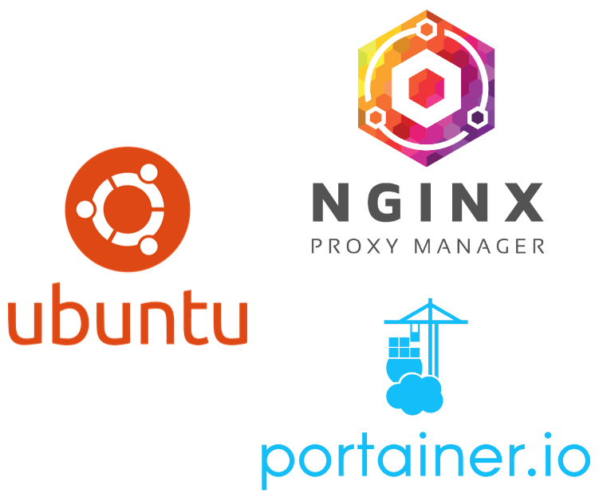

As a software engineer, I’ve long relied on [AWS for cloud computing](https://aws.amazon.com/ec2/?nc2=h_ql_prod_cp_ec2), but escalating costs prompted a reevaluation 💸. Black Friday deals just a few months ago presented an opportunity I couldn’t ignore 🎉. I invested in a [GMKtec mini PC](https://www.gmktec.com/?spm=..product_397345ec-b381-4f76-83dc-9cb6156546ee.header_1.1&spm_prev=..collection_72f4817e-5a65-4acf-bdbd-06cc49c42783.header_1.1) powered by an [AMD Ryzen 7 8845HS](https://www.gmktec.com/products/amd-ryzen-7-8845hs-mini-pc-nucbox-k8-plus?spm=..collection_72f4817e-5a65-4acf-bdbd-06cc49c42783.header_1.1&spm_prev=..product_fcda073f-26cd-4db0-8dc4-22bf93d4f8f7.header_1.1), coupled with 2 x [48GB of DDR5 5600MHz Crucial RAM](https://www.crucial.fr/memory/ddr5/CT48G56C46S5) and two [4TB Samsung 990 PRO PCIe 4.0 NVMe M.2 SSDs](https://www.samsung.com/fr/memory-storage/nvme-ssd/990-pro-4tb-nvme-pcie-gen-4-mz-v9p4t0bw/). For €1,100 (around $1,200 USD), I built a system that consumes only 35W ⚡, translating to about **€4.30 ($4.60 USD) per month** in electricity costs in France 🇫🇷. In contrast, running an [AWS EC2 instance like m8g.4xlarge costs $0.71808](https://aws.amazon.com/fr/ec2/pricing/on-demand/) per hour—approximately **$525 per month** if used continuously 💻.

This compact powerhouse offers **16 vCPUs (8 cores, 16 threads) 💻, 96GB of high-speed RAM ⚙️, and 8TB of blazing-fast PCIe 4.0 NVMe storage 💾**, making it ideal for demanding workloads. This setup not only offers immense savings 💰 but also provides the perfect foundation for a home lab powered by [Ubuntu Server 🐧](https://ubuntu.com/download/server). I’ll be using tools like [Portainer](https://www.portainer.io/) for container management 🛠️ and [Nginx Proxy Manager](https://nginxproxymanager.com/) to handle reverse proxy configurations with ease 🔄. Here’s how I made the transition—and why it’s worth considering for anyone looking to escape spiraling cloud costs 🚀.

<!-- more -->



## 🤔 Ubuntu Server, Docker, Portainer & Nginx Proxy Manager?

What are Ubuntu Server, Docker, Portainer, and Nginx Proxy Manager? Quickly:

- [**🐧 Ubuntu Server**](https://ubuntu.com/download/server): Ubuntu Server is a robust and popular [Linux-based operating system](https://www.linux.org/) designed for server environments, providing the foundation for building reliable and secure web applications and services.
- [**🐳 Docker**](https://www.docker.com/): Docker is a platform that allows developers to automate the deployment of applications inside lightweight, portable [containers](https://www.docker.com/resources/what-container/), simplifying environment management and ensuring consistency across different systems.
- [**🛠️ Portainer**](https://www.portainer.io/): Portainer is a simple and easy-to-use management interface for Docker, providing a graphical dashboard for managing containers, [images](https://hub.docker.com/search), and [volumes](https://docs.docker.com/engine/storage/volumes/), which helps streamline container operations for developers.
- [**🔄 Nginx Proxy Manager**](https://nginxproxymanager.com/): Nginx Proxy Manager is an intuitive tool for managing [Nginx](https://nginx.org/en/) proxy configurations, allowing users to easily set up [reverse proxies](https://www.cloudflare.com/learning/cdn/glossary/reverse-proxy/), [SSL certificates](https://www.cloudflare.com/learning/ssl/what-is-an-ssl-certificate/), and routing to their applications, all through a user-friendly interface.

At the end of this guide, you should be able to set up a home server environment with Ubuntu Server, Docker, Portainer, and Nginx Proxy Manager, enabling efficient management of containers and web traffic. Let's get started!

## Create bootable USB key

- Install [Rufus](https://rufus.ie/en/)
- Install [Ubuntu Server](https://ubuntu.com/download/server)
- Plug your USB key
- Open Rufus
- Device > Choose your USB key
- Boot selection > Choose the installed Ubuntu Server image
- Click on Start
- Validate pop ups and wait

## Install Ubuntu Server OS

- Plug the USB key
- Turn ON the machine and open the BIOS
- Set your the USB key as first boot priority and restart the machine
- Try or install Ubuntu Server
- Follow the instructions (choose default but some details)
  - Choose the base for the installation > Ubuntu Server
  - Network configuration to setup by cable or wifi
  - Guided storage configuration > Use an entire disk + Set up this disk as an LVM group
  - Storage configuration > ubuntu-lv > Edit > Size (max "???") > Set it to the max "???" > Save > Done
  - SSH configuration > Install OpenSSH server > Yes
  - Reboot now
  - Remove the plugged USB key and enter
- It will reboot
- Try to login if it worked, then you are ready!
- Check connection via SSH

```bash
# On the server machine
ip a
```

```bash
# On your work machine
ssh lovindata@192.168.1.X
```

- [Install Docker](https://docs.docker.com/engine/install/ubuntu/#installation-methods)

```bash
# Add Docker's official GPG key:
sudo apt-get update
sudo apt-get install ca-certificates curl
sudo install -m 0755 -d /etc/apt/keyrings
sudo curl -fsSL https://download.docker.com/linux/ubuntu/gpg -o /etc/apt/keyrings/docker.asc
sudo chmod a+r /etc/apt/keyrings/docker.asc

# Add the repository to Apt sources:
echo \
  "deb [arch=$(dpkg --print-architecture) signed-by=/etc/apt/keyrings/docker.asc] https://download.docker.com/linux/ubuntu \
  $(. /etc/os-release && echo "$VERSION_CODENAME") stable" | \
  sudo tee /etc/apt/sources.list.d/docker.list > /dev/null
sudo apt-get update
```

```bash
sudo apt-get install docker-ce docker-ce-cli containerd.io docker-buildx-plugin docker-compose-plugin
```

```bash
sudo docker version
docker compose version
```

- [Install Portainer](https://docs.portainer.io/start/install-ce/server/docker/linux#deployment)

```bash
sudo docker volume create portainer_data
```

```bash
sudo docker run -d -p 8000:8000 -p 9443:9443 --name portainer --restart=always -v /var/run/docker.sock:/var/run/docker.sock -v portainer_data:/data portainer/portainer-ce:2.25.1
```

Go to https://192.168.1.X:9443

- [Install Nginx Proxy Manager](https://nginxproxymanager.com/guide/#quick-setup)

```bash
sudo docker volume create nginx_proxy_manager_data
sudo docker volume create nginx_proxy_manager_etc_letsencrypt
```

```bash
sudo docker run -d -p 80:80 -p 443:443 -p 81:81 --name nginx_proxy_manager --restart=always -v nginx_proxy_manager_data:/data -v nginx_proxy_manager_etc_letsencrypt:/etc/letsencrypt jc21/nginx-proxy-manager:2.12.2
```

Go to http://192.168.1.X:81

## Setup to open your services securely to the outside world

- Setup your ISP router to forward ports 80 and 443 to your server
- Get the CNAME or Internet IP of your router
- Get the Local network IP of your server (ip a on the server)
- Buy a domain name
- On domain provider site: Route @ -> CNAME or Internet IP
- On domain provider site: Route nginx -> CNAME or Internet IP
- On domain provider site: Route portainer -> CNAME or Internet IP
- On nginx > SSL certificates > Add SSL certificate > Domain Names = nginx.mydomain.topleveldomain > I Agree to the Let's Encrypt Terms of Service > Save
- Same as just above but for portainer
- On nginx: Route nginx.mydomain.topleveldomain -> Scheme http / Local network IP / Port 81 / Block Common Exploits
- On nginx: Route portainer.mydomain.topleveldomain -> Scheme https / Local network IP / Port 9443 / Block Common Exploits
- Go to nginx.mydomain.topleveldomain or portainer.mydomain.topleveldomain

## An example with OpenWebUI and Ollama

- From portainer: Select `local` > Go to `Stacks` > Go to `Add stack`
- For input `Name` put `llm` or an other name
- Select `Web editor` and paste the docker following docker compose file

```yml
services:
  # https://github.com/open-webui/open-webui
  openwebui:
    image: ghcr.io/open-webui/open-webui:v0.5.4
    restart: unless-stopped
    ports:
      - ${OPENWEBUI_PORT}:8080
    environment:
      OLLAMA_API_BASE_URL: http://ollama:${OLLAMA_PORT}
    volumes:
      - openwebui_app_backend_data:/app/backend/data
    healthcheck:
      test: "curl -f http://localhost:8080"
      interval: 10s
      timeout: 5s
      retries: 5
    depends_on:
      ollama:
        condition: service_healthy

  # https://hub.docker.com/r/ollama/ollama/tags
  ollama:
    image: ollama/ollama:0.5.4
    restart: unless-stopped
    ports:
      - ${OLLAMA_PORT}:11434
    volumes:
      - ollama_root_ollama:/root/.ollama
    healthcheck:
      test: "ollama --version && ollama ps || exit 1" # https://github.com/ollama/ollama/issues/1378#issuecomment-2436650823
      interval: 10s
      timeout: 5s
      retries: 5

volumes:
  openwebui_app_backend_data:
    driver: local
  ollama_root_ollama:
    driver: local
```

- In `Environment variables` section, click on `Add an environement variables` two times
- Add the two following environement variables
  - `OPENWEBUI_PORT` with the value `11435`
  - `OLLAMA_PORT` with the value `11434`
- Click on Deploy the stack
- On domain provider site: Route llm -> CNAME or Internet IP
- On nginx > SSL certificates > Add SSL certificate > Domain Names = llm.mydomain.topleveldomain > I Agree to the Let's Encrypt Terms of Service > Save
- On nginx: Route llm.mydomain.topleveldomain -> Scheme https / Local network IP / Port 11435 / Block Common Exploits / Websockets Support
- Go to llm.mydomain.topleveldomain
